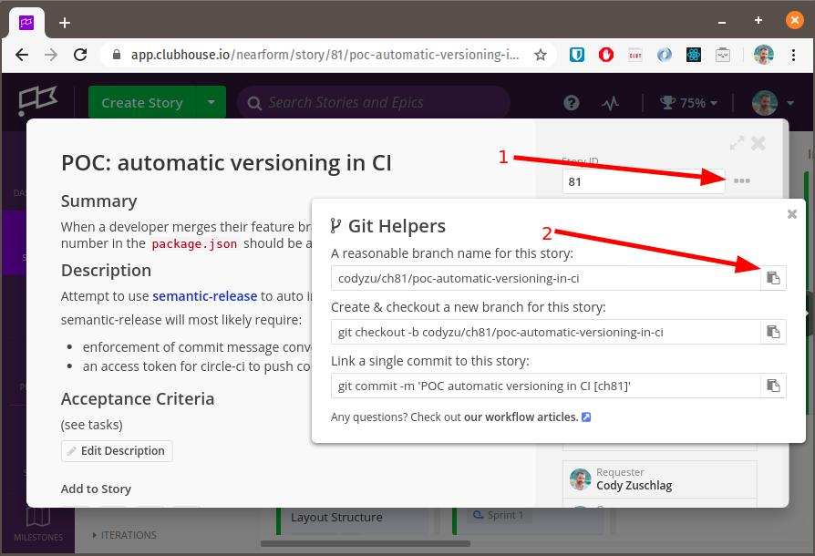

# Quick Start


## Project Setup

### 1. Clone and install dependencies

```
git clone https://github.com/nearform/raw-salmon.git

cd raw-salmon

yarn
```

### 2. Configure

Most of the configuration comes from environment variables. Required environment variables for each part of the architecture are documented in the `.env.sample` files inside the repository.

- knowledge-base [`.env.sample`](../../packages/knowledge-base/.env.sample) - build time environment variables for the Gatsby applications. They should also be configured in CI, along with any other environment variables required by CI
- assess-base [`.env.sample`](../../packages/assess-base/.env.sample) - optional overrides if assess-base needs different env variables to those it inherits from knowledge-base
- hasura [`.env.sample`](../../packages/hasura/.env.sample) - runtime environment variables for Hasura and Hasura console. To run the Hasura console, it also needs to be installed and seeded as per the [Hasura package readme](../../packages/hasura).
- functions [`.env.sample`](../../packages/functions/.env.sample) - runtime environment variables for AWS Lambda functions.
- e2e-tests [`.env.sample`](../../packages/e2e-tests/.env.sample) - runtime environment variables for end-to-end testsusing Testcafe.

Shared secrets are stored in a vault. Get in touch with a team member to get access to it.

## Contributing

1. Clone the project.
1. Pick a story to work on from the clubhouse project.
1. Work on a new branch, using the [name suggested by clubhouse](https://help.clubhouse.io/hc/en-us/articles/207540323-Using-the-Clubhouse-GitHub-Integration-with-Branches-and-Pull-Requests) by clicking on the github helpers button on your story. Clubhouse will use the convention `{username}/ch{story number}/{story-summary}`. For example `codyzu/ch81/poc-automatic-versioning-in-ci`.
   
1. Commit changes using conventional commits via [Commitizen](http://commitizen.github.io/cz-cli/):
   1. `yarn commit` from the repo root
   1. `git cz` if you have installed Commitizen globally with npm
   1. `npx git-cz` from anywhere in the repo. _Note: this runs git-cz directly, skipping commitizen and disabling its ability to [`--retry` commits](https://github.com/commitizen/cz-cli#retrying-failed-commits)._
   1. your favorite tool ⚠️ Warning: commit messages are linted. See details below.
   
   💡Options 1 and 2 above, support commitizen's ability to [`--retry` failed commit attempts](https://github.com/commitizen/cz-cli#retrying-failed-commits) (due to linting or other reasons).
1. Follow the [conventional-commits](https://www.conventionalcommits.org/en/v1.0.0/) commit conventions. Generally, the format should match:

   ```
   <type>[(<scope>)]: <subject>
   ```

   where the scope is optional.

   **⚠️ Commit messages are linted!!!**

   💡 Use Commitizen as described in the previous step to ensure correctly formatted messages.

   💡 Include the clubhouse story tag in your commit messages to create a link between your story and github. Clubhouse uses the form `[ch1234]` where 1234 is the story number. If using Commitizen, use the entire tag, `[ch1234]`, in the "Issues this commit closes" prompt.

   🚑 _In case of emergency_ (or when rebasing), you can disable commit linting by deactivating git hooks with either of the following:

   - `git commit --no-verify ...`
   - `HUSKY_SKIP_HOOKS=1 git ...`

1. Create a pull request and get someone to review it.
1. Once approved, you as the author of the PR should merge it.

## Running the application

Ensure you have a local `.env.development` file available.

```
# Starts knowledge-base via `gatsby develop`
yarn start:kb

# Starts assess-base via `gatsby develop`
yarn start:ab

# Runs both the above in parallel
yarn start:apps
```

## Storybook

The components package contains storybook stories to document and test the components contained therein.

A hosted version of the storybook stories is running at https://raw-salmon-storybook.nearform.com

```
cd packages/components
yarn storybook
```
